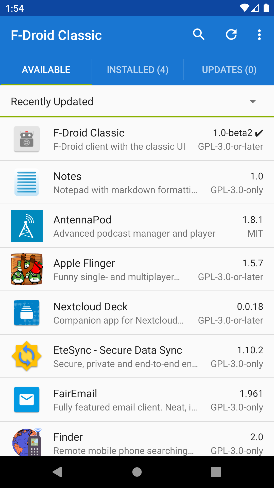
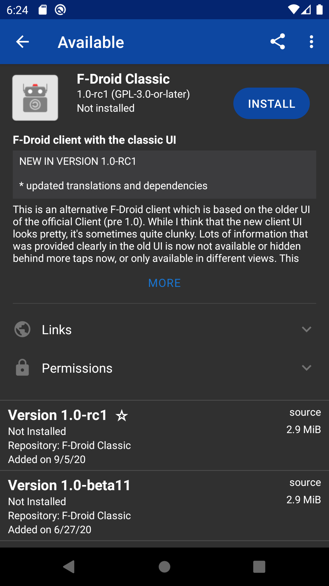
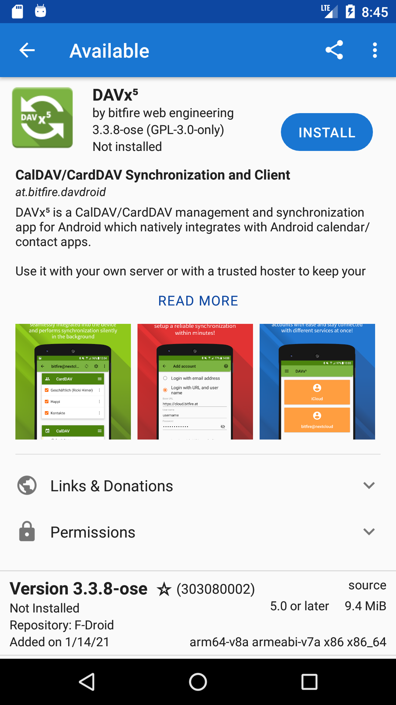

## F-Droid Classic

Join the matrix room: [#fdroidclassic:bubu1.eu](https://matrix.to/#/#fdroidclassic:bubu1.eu)

### Download

Direct APK download [here](https://bubu1.eu/fdroidclassic/fdroid/repo/eu.bubu1.fdroidclassic_1106.apk).

### Beta versions/faster updates
In F-Droid Classic you can just enable the F-Droid Classic Repo, beta versions will be distributed there.
Releases will also be available there a couple of days before they make it into the official repo.

If you need to re-add the repository: https://bubu1.eu/fdroidclassic/fdroid/repo?fingerprint=5187CFD99F084FFAB2AD60D9D10B39203B89A46DD4862397FE1B1A4F3D46627A

### Project description

This is an alternative F-Droid client which is based on the older UI of the official Client (pre 1.0).
While I think that the new client UI looks pretty, it's sometimes quite clunky.
Lots of information that was provided clearly in the old UI is now not available or hidden behind more taps now, or only available in different views.

This project is probably aimed more at the power user who values function over form. Or people who absolutely cannot stand the tile-based new UI.

## Status

### What works

* index-v1 support.
* **Privileged Extension** support (Somewhat WiP, see FAQ below)
* Inline changelogs
* Showing screenshots
* Translation and Donations options
* Localized metadata
* Lots of usability improvements and bug fixes over the official client (some of them are backported by now)

### Todo

* proper mirror support. They are currently not completely broken, but I'm not actually sure if mirrors are really used right now.
* There are some occasional performance problems where the UI gets stuttery, this is tracked in #43 (with more background in #23).
* The internals of the app are quite dated by now, which makes developing it further challenging. Major parts of it will need to be rewritten in the near-future.

### Features NOT included

* Swap. I almost never use it and I don't know many people that do. There's still the official client if you need that functionality.
* App auto install via repo push
* The tile based UI
* The old xml based index format isn't supported
* Support for old version of Android (< 4.4).
  * Minimum Android version will be increased to 5.0 with the upcoming version 1.2 (the TLS support is bad on these old devices and it's really hard to maintain)

## Building with Gradle

    ./gradlew assembleRelease

## FAQ

* What about privileged extension support?

Currently being worked on. There is a separate privileged extension for Classic, it's available via the F-Droid Classic repository that can be enabled in Settings.

There's a guide for getting this enabled here: https://gbatemp.net/threads/android-f-droid-classic-and-the-new-privileged-extension.583129/
It works very well once set up, but the install procedure is slightly involved. There's ongoing work to make this easier.

* Which repositories can be included in the default list?

All software distributed by these repositories must be fully FOSS, just like it is for the f-droid.org repository. (That means no proprietary FCM libraries included inside apps).
Additionally it would be preferable if the apps were also distributed via the f-droid.org repository later on via reproducible builds (like both F-Droid Classic and NewPipe are), but that's not a strict requirement for now.

## Translation

Translations are here: https://weblate.bubu1.eu/projects/f-droid-classic/

## License

This program is Free Software: You can use, study share and improve it at your
will. Specifically you can redistribute and/or modify it under the terms of the
[GNU General Public License](https://www.gnu.org/licenses/gpl.html) as
published by the Free Software Foundation, either version 3 of the License, or
(at your option) any later version.
